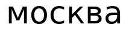
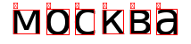
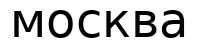

# Лабораторная работа №7 — Классификация на основе признаков

**Вариант 14** | Алфавит: русский (а–я, 32 символа) | Строка: `москва`

---

## Цель

Реализовать распознавание символов строки на основе нормализованных признаков
(масса, центр тяжести, осевые моменты инерции) и оценить качество распознавания.

---

## Теория

### Признаковое описание символа

Для каждого символа в bounding-box размером `w × h` вычисляются:

**Масса** — доля пикселей переднего плана:
```
mass = sum(fg) / (w · h)
```

**Центр тяжести** (нормированный в [0, 1]):
```
cx = mean_x(fg) / (w - 1)
cy = mean_y(fg) / (h - 1)
```

**Осевые моменты инерции** (нормированные):
```
Ixx = sum((y − ȳ)² · fg) / (mass · (h−1)²)
Iyy = sum((x − x̄)² · fg) / (mass · (w−1)²)
```

где суммирование ведётся только по пикселям переднего плана.

**Итоговый вектор признаков:**
```
f = [mass, cx, cy, Ixx, Iyy]
```

---

### Мера близости

Евклидово расстояние между двумя признаковыми векторами:
```
d(f, g) = sqrt( Σ (fi − gi)² )
```

Преобразование в меру близости (нулевое расстояние → единичная близость):
```
sim = 1 / (1 + d)
```

---

## Структура проекта

```
lab7/
├── src/
│   ├── features.py       # признаки: mass, cx, cy, Ixx, Iyy + мера близости
│   ├── segmentation.py   # рендер строки, бинаризация, сегментация символов
│   ├── classifier.py     # построение алфавита, гипотезы, метрики качества
│   └── main.py           # CLI
├── assets/               # изображения (создаются при --save-images)
├── outputs/              # hypotheses.txt, results.json
└── requirements.txt
```

---

## Установка

```bash
pip install -r requirements.txt
```

---

## Запуск

### 1) Базовое распознавание

```bash
python src/main.py --text "москва" --font-size 52 --font-path /path/to/font.ttf
```

### 2) Эксперимент с другим размером шрифта (п.6)

```bash
python src/main.py \
  --text "москва" \
  --font-size 52 \
  --variation-font-size 48 \
  --font-path /path/to/font.ttf \
  --save-images \
  --hypotheses-out outputs/hypotheses.txt \
  --json-out outputs/results.json
```

> Если `--font-path` не указан, используется встроенный шрифт Pillow.  
> Для кириллицы рекомендуется DejaVuSans.ttf (входит в большинство дистрибутивов Linux).

---

## Параметры CLI

| Флаг | По умолчанию | Описание |
|---|---|---|
| `--text STR` | — | Распознаваемая строка *(обязательный)* |
| `--alphabet STR` | а–я (32 символа) | Алфавит эталонов |
| `--font-size N` | 52 | Базовый размер шрифта (pt) |
| `--variation-font-size N` | — | Размер шрифта для эксперимента |
| `--font-path PATH` | встроенный | Путь к .ttf файлу |
| `--save-images` | выкл. | Сохранить рендер и сегментацию в `assets/` |
| `--hypotheses-out PATH` | — | Файл для записи гипотез |
| `--json-out PATH` | — | JSON с полными результатами |

---

## Пример вывода

Запуск:
```bash
python src/main.py --text "москва" --font-size 52 --variation-font-size 48 \
  --font-path /usr/share/fonts/truetype/dejavu/DejaVuSans.ttf \
  --save-images --hypotheses-out outputs/hypotheses.txt
```

**Гипотезы (52pt):**
```
1: [("м", 1.00), ("п", 0.13), ("й", 0.07), ("р", 0.07), ("н", 0.05), ("ц", 0.05), ("и", 0.05), ...]
2: [("о", 1.00), ("л", 0.08), ("е", 0.08), ("а", 0.06), ("и", 0.05), ("в", 0.04), ("д", 0.04), ...]
3: [("с", 1.00), ("ъ", 0.14), ("л", 0.07), ("з", 0.07), ("у", 0.07), ("х", 0.07), ("э", 0.06), ...]
4: [("к", 1.00), ("я", 0.22), ("в", 0.10), ("ы", 0.09), ("ь", 0.09), ("э", 0.07), ("а", 0.07), ...]
5: [("в", 1.00), ("я", 0.14), ("а", 0.12), ("э", 0.11), ("к", 0.10), ("е", 0.09), ("л", 0.06), ...]
6: [("а", 1.00), ("е", 0.22), ("в", 0.12), ("я", 0.09), ("л", 0.09), ("к", 0.07), ("э", 0.06), ...]

Лучшие гипотезы: москва
Исходная строка: москва
```

**Ошибок: 0 | Точность: 100.0%**

---

## Эксперимент: сравнение шрифтов 52pt vs 48pt

**Гипотезы (48pt):**
```
1: [("м", 1.00), ("п", 0.10), ("й", 0.10), ("р", 0.07), ("н", 0.06), ("ц", 0.06), ("и", 0.06), ...]
2: [("о", 1.00), ("л", 0.10), ("е", 0.09), ("а", 0.07), ("и", 0.05), ("у", 0.05), ("в", 0.05), ...]
3: [("с", 1.00), ("ъ", 0.13), ("л", 0.09), ("у", 0.08), ("з", 0.07), ("е", 0.07), ("х", 0.07), ...]
4: [("к", 1.00), ("я", 0.31), ("в", 0.19), ("э", 0.11), ("а", 0.09), ("ы", 0.09), ("ь", 0.09), ...]
5: [("в", 1.00), ("я", 0.20), ("к", 0.19), ("а", 0.14), ("е", 0.11), ("э", 0.10), ("ы", 0.07), ...]
6: [("а", 1.00), ("е", 0.26), ("в", 0.14), ("л", 0.10), ("я", 0.10), ("к", 0.09), ("о", 0.07), ...]

Лучшие гипотезы: москва
Исходная строка: москва
```

**Ошибок: 0 | Точность: 100.0%**

| | Шрифт 52pt (базовый) | Шрифт 48pt (вариация) |
|---|---|---|
| Распознано | `москва` | `москва` |
| Ошибок | 0 | 0 |
| Точность | **100%** | **100%** |

**Вывод:** изменение размера шрифта на 4pt не влияет на точность распознавания.
Нормализованные признаки (масса, центр тяжести, моменты инерции) вычисляются
в относительных координатах bounding-box и инвариантны к масштабу символа.

---

## Визуализация

### Сгенерированная строка (52pt)



### Сегментация и лучшие гипотезы (52pt)



*Красные рамки — сегменты символов; подписи сверху — лучшая гипотеза.*

### Вариация шрифта (48pt)



---

## Описание модулей

### `features.py`

| Функция | Описание |
|---|---|
| `extract_features(img)` | Признаковый вектор [mass, cx, cy, Ixx, Iyy] |
| `euclidean_distance(f1, f2)` | Евклидово расстояние |
| `similarity(f1, f2)` | Мера близости `1/(1+d)` |

### `segmentation.py`

| Функция | Описание |
|---|---|
| `render_text(text, size, font)` | Рендер строки в grayscale ndarray |
| `binarize(gray)` | Пороговая бинаризация |
| `segment_chars(binary)` | Сегментация по вертикальной проекции |
| `draw_segmentation(gray, segs, labels)` | Визуализация bounding-box |

### `classifier.py`

| Функция | Описание |
|---|---|
| `build_alphabet(chars, font_size)` | Эталонные признаки для всех букв алфавита |
| `classify_segment(img, alphabet)` | Список гипотез для одного символа |
| `classify_line(segments, alphabet)` | Гипотезы для всей строки |
| `recognition_metrics(hyps, gt)` | Количество ошибок и точность (%) |
